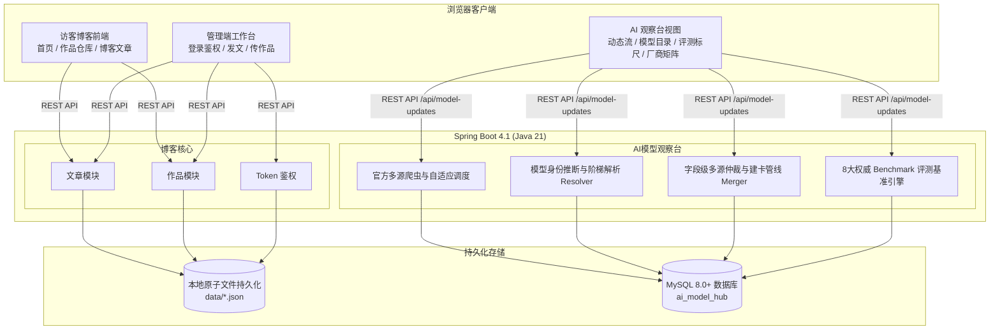

# 我的个人站 & 全球 AI 模型动态观察台

前后端分离架构的个人全栈系统：**作品仓库 + 心得文章 + 全球前沿 AI 模型动态与评测观察台 (AI Model Observatory)**。

## 架构



## 目录结构

```
博客\
├── backend\    Spring Boot 后端（当前 Spring Boot 4.1 / Java 21）
├── frontend\   Vue 3 + Vite 前端
├── tools\      本地开发工具链（JDK、Maven、缓存，不入库，见 .gitignore）
└── README.md
```

## 本地启动

**最简方式（推荐）**：双击项目根目录的 `启动后端.bat` 和 `启动前端.bat`（各自弹出一个控制台窗口，**保持窗口开启**即服务运行），然后浏览器访问 http://localhost:5180 。停止服务：在对应窗口按 `Ctrl+C` 或关闭窗口。

### 方式一：自己的终端（推荐，无沙箱限制）

```powershell
# 后端（首次运行 mvnw 会自动下载 Maven）
cd D:\code_files\博客\backend
$env:JAVA_HOME = 'D:\code_files\博客\tools\jdk'
.\mvnw.cmd spring-boot:run '-Dmaven.repo.local=D:\code_files\博客\tools\m2-repo'

# 前端（另开一个终端）
cd D:\code_files\博客\frontend
npm install
npm run dev
```

- 后端地址：http://localhost:8080（验证接口：`/api/hello`）
- 前端地址：http://localhost:5180（`/api` 请求自动代理到后端；5173 已被本机其他应用占用，故固定用专属端口 5180）

### 自动化可靠性校验套件

在本地终端一键执行信源可靠性与防再污染全链路自动化回归校验：
```powershell
powershell -ExecutionPolicy Bypass -File scripts\verify-crawler-reliability.ps1
```
涵盖 10 项核心机器级断言（活跃信源 24、确认事件基线 53、9月22/25日双条带证据、滚动路由别名拦截、官方动态流置顶更新、前台无空日期条目、覆盖矩阵标准语义、厂商正交隔离、信源健康度双轨统计正常且零异常源），持续守护工程质量。

### 方式二：agent 沙箱内（受限环境实测结论）

沙箱限制：不可写 C 盘用户目录、禁止子进程管道/控制台初始化。实测：

- **后端可以跑**，但 `spring-boot:run` 会因 fork 子 JVM 失败（0xC0000142），改用两步：

  ```powershell
  cd D:\code_files\博客\backend
  $env:JAVA_HOME = 'D:\code_files\博客\tools\jdk'
  & 'D:\code_files\博客\tools\maven\bin\mvn.cmd' -DskipTests package '-Dmaven.repo.local=D:\code_files\博客\tools\m2-repo'
  & 'D:\code_files\博客\tools\jdk\bin\java.exe' -jar target\backend-0.0.1-SNAPSHOT.jar
  ```

- **前端开发服务器无法在沙箱内运行**（Vite/esbuild 依赖子进程管道通信），请在自己的终端执行 `npm run dev`
- npm 安装需带 `--ignore-scripts --cache D:\code_files\博客\tools\npm-cache`
- 下载工具链时 curl/IWR 的 TLS 不可用，用 `tools\dl.mjs`（Node fetch）下载

## 里程碑路线
 
| 里程碑 | 内容 | 状态 |
|---|---|---|
| M1 | 环境就绪 + 前后端骨架 + `/api/hello` 联调闭环 | ✅ 已完成并验证 |
| M2 | 持久化数据建模 + 管理员安全登录（Token 拦截鉴权） | ✅ 已完成并验证（内置轻量可靠数据引擎） |
| M3 | 作品仓库模块：网格展示 / 在线体验 / 源码链接 / 增删改查 | ✅ 已完成并验证 |
| M4 | 文章模块（轻量 Markdown 实时解析高亮）+ 访客端全套页面 + 归档时间轴 + 浏览量统计 | ✅ 已完成并验证 |
| M5 | 站长管理后台：双栏响应式实时 Markdown 编辑器 + 数据看板 + 文章作品全量在线维护 | ✅ 已完成并验证 |
| M6 | 一体化合体部署：单 Jar 包内嵌静态托管与 SPA History 模式自动路由转发 | ✅ 已完成并验证 |
| M7 | 全球 AI 模型动态观察台：23+ 原厂信源自适应错峰巡检 (SLA P95 ≤ 15m) + 中文技术增量摘要 | ✅ 已完成并验证 |
| M8 | 工业级多源字段事实仲裁管线：`ModelFactMerger`（发布日期 min+60天护栏、定价归一、托管商渠道过滤、原厂推断、静态页阻断与国内外地域清洗） | ✅ 已完成并验证 (Flyway V17~V31) |
| M9 | 权威 Benchmark 评测体系与模型全生命周期档案：8大主流评测集 + 五维能力雷达标尺 + 历史演进轴 | ✅ 已完成并验证 |
| M10 | 信源可信度治理与防再污染机制：死链与重复源停用 (核准至 24 活跃官方信源)、真实历史回填流水线、Changelog 跨层级结构抽取、审查锁定防覆盖与前台发布日期门禁收严 | ✅ 已完成并验证 (Flyway V32~V35) |

## AI 模型动态观察台核心功能

1. **官方动态追踪流**：聚合 OpenAI、Anthropic、DeepMind、Meta、DeepSeek、阿里等全球主流厂商官方最新发布，展示提炼后的高价值中文技术事实摘要；支持按 20 家原厂品牌色胶囊条一键正交筛选，与主题分类、月份和关键词深度联动并双向同步 URL。
2. **基准模型档案库**：收录前沿核心大模型系列，支持按**国内大模型 / 海外前沿**一键多维筛选，支持核心模态能力标签、上下文窗口与定价查询。
3. **8 大权威评测基准标尺**：覆盖 MMLU-Pro、Arena Elo、SWE-bench Verified、HumanEval、MATH-500、GPQA Diamond、LiveCodeBench、GSM8K 等，提供模型综合能力量化雷达与演进历史对比。
4. **工业级数据仲裁管线**：内置真实原厂研发推断引擎（`inferRootVendorId`），彻底解耦“模型研发厂商”与“算力云托管商”；第三方目录新模型严格收敛为待审，保障数据真实性。
5. **管理端信源台账与真实覆盖审计**：呈现每条信源的双轨捕获/确认计数与解析健康度指标；月度覆盖矩阵严格以 `VERIFIED_COVERED` / `VERIFIED_EMPTY` 呈现真实归档网络遍历事实。

## 技术决策记录

- **Spring Boot 4.1 + Java 21**：现代企业级框架基线，虚拟线程与新一代 Starter 契约。
- **双模存储架构**：个人站采用本地原子写入持久化引擎，免除无数据库依赖时的运维成本；AI 模型观察台采用 MySQL 8.0 + Alibaba Druid 连接池 + Flyway 自动化版本迁移（当前基线已演进至 **Flyway V35**）。
- **前端原生架构**：Vue 3.5 + Vite 6 + 原生 ESM 与 Fetch 通信，兼顾极速加载与轻量免依赖体验。
- **自动化防回退回归测试**：内置 `scripts/verify-crawler-reliability.ps1` 校验套件（PowerShell / UTF-8 BOM，10 项信源可靠性与防再污染断言），提供机器级回归保护。
