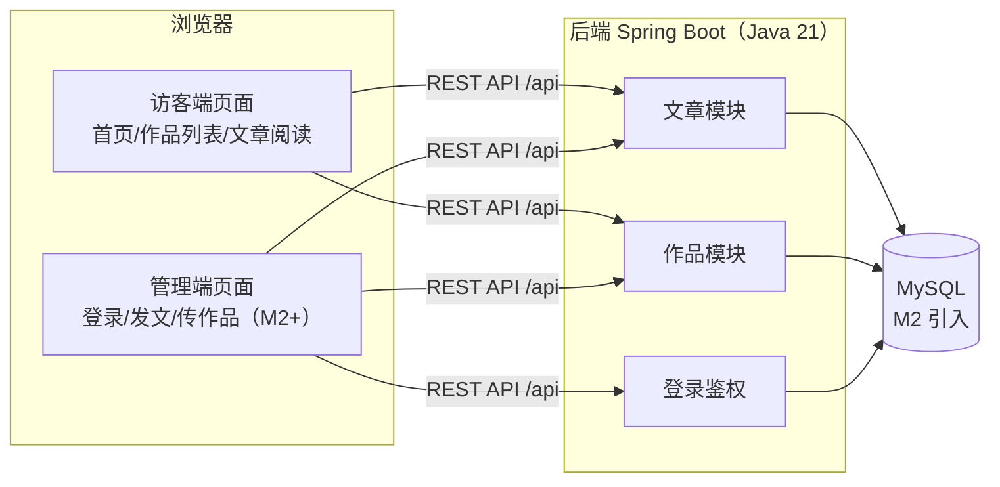

# 我的个人站

从零亲手搭建的个人网站：**作品仓库 + 心得文章**。前后端分离架构，全部代码自己编写。

## 架构



## 目录结构

```
博客\
├── backend\    Spring Boot 后端（当前 Spring Boot 4.1 / Java 21）
├── frontend\   Vue 3 + Vite 前端
├── tools\      本地开发工具链（JDK、Maven、缓存，不入库，见 .gitignore）
└── README.md
```

## 本地启动

**最简方式（推荐）**：双击项目根目录的 `启动后端.bat` 和 `启动前端.bat`（各自弹出一个控制台窗口，**保持窗口开启**即服务运行），然后浏览器访问 http://localhost:5180 。停止服务：在对应窗口按 `Ctrl+C` 或关闭窗口。

### 方式一：自己的终端（推荐，无沙箱限制）

```powershell
# 后端（首次运行 mvnw 会自动下载 Maven）
cd D:\code_files\博客\backend
$env:JAVA_HOME = 'D:\code_files\博客\tools\jdk'
.\mvnw.cmd spring-boot:run '-Dmaven.repo.local=D:\code_files\博客\tools\m2-repo'

# 前端（另开一个终端）
cd D:\code_files\博客\frontend
npm install
npm run dev
```

- 后端地址：http://localhost:8080（验证接口：`/api/hello`）
- 前端地址：http://localhost:5180（`/api` 请求自动代理到后端；5173 已被本机其他应用占用，故固定用专属端口 5180）

### 方式二：agent 沙箱内（受限环境实测结论）

沙箱限制：不可写 C 盘用户目录、禁止子进程管道/控制台初始化。实测：

- **后端可以跑**，但 `spring-boot:run` 会因 fork 子 JVM 失败（0xC0000142），改用两步：

  ```powershell
  cd D:\code_files\博客\backend
  $env:JAVA_HOME = 'D:\code_files\博客\tools\jdk'
  & 'D:\code_files\博客\tools\maven\bin\mvn.cmd' -DskipTests package '-Dmaven.repo.local=D:\code_files\博客\tools\m2-repo'
  & 'D:\code_files\博客\tools\jdk\bin\java.exe' -jar target\backend-0.0.1-SNAPSHOT.jar
  ```

- **前端开发服务器无法在沙箱内运行**（Vite/esbuild 依赖子进程管道通信），请在自己的终端执行 `npm run dev`
- npm 安装需带 `--ignore-scripts --cache D:\code_files\博客\tools\npm-cache`
- 下载工具链时 curl/IWR 的 TLS 不可用，用 `tools\dl.mjs`（Node fetch）下载

## 里程碑路线
 
| 里程碑 | 内容 | 状态 |
|---|---|---|
| M1 | 环境就绪 + 前后端骨架 + `/api/hello` 联调闭环 | ✅ 已完成并验证 |
| M2 | 持久化数据建模 + 管理员安全登录（Token 拦截鉴权） | ✅ 已完成并验证（内置轻量可靠数据引擎） |
| M3 | 作品仓库模块：网格展示 / 在线体验 / 源码链接 / 增删改查 | ✅ 已完成并验证 |
| M4 | 文章模块（轻量 Markdown 实时解析高亮）+ 访客端全套页面 + 归档时间轴 + 浏览量统计 | ✅ 已完成并验证 |
| M5 | 站长管理后台：双栏响应式实时 Markdown 编辑器 + 数据看板 + 文章作品全量在线维护 | ✅ 已完成并验证 |
| M6 | 一体化合体部署：单 Jar 包内嵌静态托管与 SPA History 模式自动路由转发 | ✅ 已完成并验证 |

## 技术决策记录

- **Spring Boot 4.1**（start.spring.io 当前默认）：新一代 starter 命名（如 `spring-boot-starter-webmvc`）。
- **MyBatis-Plus 推迟引入**：其对 SB4 的兼容性尚待验证，M1 无数据库场景，待 M2 引入数据库时一并确定（备选：Spring Data JDBC / JPA）。
- **免安装工具链**：JDK 21 与 Maven 3.9.9 均解压在 `tools\`，不污染系统 PATH，删除目录即卸载。
