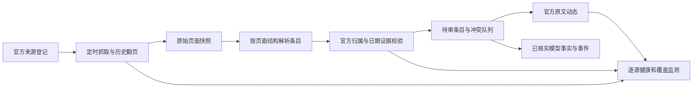

# 数据采集可信度改造方案

> 核查与成文：2026-09-28 20:48—20:52（北京时间）  
> 适用范围：AI 厂商官方模型动态、版本变化、模型目录中的发布日期及其证据。本文是实施文档；本轮未修改程序或数据库。

## 优先级确认｜及时性与真实性（追加时间：2026-09-28 22:01 +08:00）

本项目先把两件事做可靠，再扩大模型目录和消息数量：

| 用户要求 | 系统必须做到 | 不合格时的处理 |
|---|---|---|
| **及时性**：厂商一有官方新消息，本站应尽快发现并展示。 | 核心官方 RSS/更新日志建议每 5 分钟检查一次，其余官方归档每 15 分钟检查一次；每次记录实际检查、有效解析、首次发现、通过校验及公开时间。增量检查之外每天对官方归档复扫补漏。间隔是实施目标，必须以运行记录证明实际达到。 | 请求失败、解析器失效、积压过久或归档发现漏项时告警、补抓并展示该厂商覆盖异常；不能继续显示“来源健康”或悄悄沿用旧消息。 |
| **真实性**：用户看到的“官方”消息及其日期和内容必须可核对。 | 只从厂商控制的官方渠道获取原文；校验最终跳转域名/官方组织、正文、日期位置和厂商归属，保存原文快照。文章动态与“模型首发”等结构化事实分别校验；每个已确认事实保留对应原文片段。 | 无官方原文、日期不明、型号或事件类别有冲突时留在待审区；不得进入“已核实”时间线，不给出猜测的发布日期和中文简介。 |

**衡量时效必须使用真实时间。** 对提供精确发布时间的官方来源，统计 `visible_at - 官方发布时间`；对只给出日历日期的页面，不能伪造发布时刻或宣称“发布后 1 小时内发现”，应统计实际检查间隔以及 `visible_at - first_seen_at`，并将原文日期精度标为“日”。上线后的建议目标：有精确发布时间的有效公告 95% 在 1 小时内、99% 在 6 小时内公开；所有符合自动发布条件的官方原文在首次发现后 10 分钟内完成校验和展示。无法通过校验的条目及时进入待审队列，并报告积压时长。上述指标应按厂商逐一展示，不能用全站平均数掩盖单个厂商长期漏抓。

**两条路径同时运行：** 来源和文章证据充分时，官方原文动态可自动、快速公开；“型号首发、版本演进、能力参数”等会改变模型事实的结论必须再过字段证据闸门。这样及时给用户看到厂商原文，也不会把未经核实的推断写成已确认事实。管理员主要处理冲突和失败源；不能依靠管理员手动搬运每条新闻来维持时效。

## 保证机制与失败处理（追加时间：2026-09-28 22:03 +08:00）

| 要保证什么 | 公开前的强制规则 | 运行时怎样发现失效 | 失效后的动作 |
|---|---|---|---|
| **来源官方** | 来源登记明确厂商控制的域名、官方仓库组织/路径；抓取后复核最终跳转 URL 和页面归属。保存原文 URL、抓取快照与内容哈希。 | 出现未登记域名、跳到第三方、来源与条目厂商不一致，或原文无法打开。 | 进入待核实队列并报警；第三方内容只作为线索，不进入“官方原文”与确认事件。 |
| **内容准确** | 公告标题、日期、正文齐全；结构化模型事实分别有原文片段支撑。严格区分首发、版本更新、API 上架、修复和普通产品资讯。中文简介逐句可回到原文事实。 | 日期冲突、型号别名不明、正文变化、重复首发、摘要含无证据内容，或文章与模型厂商不符。 | 阻断确认事实，保留原始值与冲突记录；旧确认事实的证据失效时重新审核并撤下相应结论。 |
| **发现及时** | 调度按来源频率实际执行；抓取、有效解析、首次发现、校验通过、公开分别记时间。符合机器校验条件的官方原文自动公开。 | 超过检查间隔未巡检、连续解析为空、最新归档有条目但增量流没有、发现到公开超目标时长。 | 对单个来源告警并重试；从官方归档补抓漏项，记录补入时间和影响范围；该来源状态标异常。 |
| **历史覆盖可证** | 每个来源和月份记录翻页游标、访问页数、到达的归档边界及快照；只有遍历完成才标“已覆盖”或“已核查无更新”。 | 游标中断、源站限制、分页深度不足、解析器改版、条目日期落在覆盖区间却缺失。 | 标 `INCOMPLETE` 并生成回填任务；公开覆盖缺口，不用已有条目数推断“采全”。 |
| **质量不回退** | 每次解析器、来源配置或数据迁移变动前，回放 26 个来源的固定真实样本；批次通过质量闸门后才切换公开数据。 | 固定样本漏收、导航误入、无日期确认、跨厂商错归、重复事件或错误健康状态再现。 | 拒绝本批发布，保留上一版可追溯结果；修复后重放并输出差异报告。 |

**每条公开消息都要能生成一张审计卡：** 厂商与官方渠道、最终原文 URL、原文日期及其页面位置、原文片段、首次发现/公开时间、解析器版本、审核状态和后续修订记录。首页的“最新”按这张卡的可信日期排序；只有日期精度为“日”的条目不得伪造具体小时。用户点击能打开厂商原文，管理员能回看当时抓到的快照。

**验收演练应直接模拟故障：** 厂商新发一条有效公告、同日两条公告、页面插入导航、官方链接跳转第三方、原文更改发布日期、HTTP 304、站点结构变化、归档分页中断以及补抓。逐项核对页面、API、数据库、来源健康和告警：真实公告按目标时间出现，错误条目被阻断，缺口明确可见，补抓后有记录可追溯。

这里能给出硬保证的是**已确认内容有可核对的官方证据和公开过程可追溯**；“全球绝无漏收”无法从有限来源直接证明，因此必须公开已监控渠道及每月覆盖状态，让没有证据的范围始终显示为未验证。

## 一、目标与发布原则

网站对用户的承诺应是：**每条标为“已核实”的消息，都能回到对应厂商控制的官方原文，逐项核对厂商、型号、事件类别、发布日期和核心内容；任何不能核对的字段都明确标为待核实。** 第三方聚合站、API 网关、媒体和社区只能提供发现线索，不能替代厂商证据。

“采全”也要有可核对的范围：先公布覆盖的厂商和官方渠道清单，再证明每个渠道在指定时间段内已翻完归档或说明缺口。不能仅凭数据库有多少条、任务显示 `COMPLETED` 或某个月有 3 条，就称当月采集完整。对厂商没有发布内容的月份，可在完成归档巡查后记为“已核查无更新”；无法访问或无法翻页时记为“覆盖未确认”，不把空白当作无消息。

公开信息分两层：

1. **官方原文动态**：原文 URL 的归属、文章正文和原文日期通过机器校验后可及时展示，保留“已核实官方来源”标记；分类或型号关系未确认时不要写成“模型首发”。
2. **结构化模型事实**：型号首发、版本演进、能力、参数、API 上架和模型目录发布日期，必须有对应字段的原文证据；证据不足时进入待审，不自动写入确认时间线。

## 二、当前基线与不能信任的统计

2026-09-28 20:50 的本地只读快照：**26 条启用来源覆盖 20 家厂商**，其中 16 条显示 `HEALTHY`、9 条 `PARSE_EMPTY`、1 条 `ERROR`。公开 `source_items` 为 **496** 条，**470** 条仍为 `PENDING`；**257** 条发布日期与首次发现日同日，属于日期证据复核队列，不可直接认定每条都错。现有 58 条确认事件均关联证据行，但尚未逐字段验证证据正文能否支撑全部断言。

特别需要停止使用以下“完成”信号：

| 当前信号 | 实际含义与问题 |
|---|---|
| 来源 `HEALTHY` | HTTP 304 会直接改绿。OpenAI changelog 的来源 26 仍显示 `HEALTHY`、解析数 50，但这 50 条全是无日期且已隔离的导航项；来源 8 和 25 也显示健康而最新有效发布日期为空。 |
| 回填任务 `COMPLETED` | `AiModelService.createBackfillJob()` 只统计现有来源、现有动态和现有事件，并未访问任何历史归档或逐页回抓；已保存的若干任务约 0—1 秒即完成。`sources_processed` 只是启用来源数，`candidates_found` 只是库内现有公开条目数。 |
| 月度覆盖 `FULL` | 当前仅因库内该厂商该月 `published_at` 条目数达到 3 而判 `FULL`，不证明归档翻页完成、文章日期可靠或没有遗漏；月份数组还写死为 2026 年 1—9 月。 |
| 最近一次抓取成功 | 只证明请求完成；未证明正文解析成功、发布日可用、候选审核完成或页面上的新公告已入库。 |

高风险来源先处理：DeepSeek 的两个来源当前最新有效日期分别停在 **2025-06-27** 和 **2024-08-02**；Qwen 两个入口均为 `PARSE_EMPTY`；Meta、豆包、腾讯、AI21、Stability、MiniMax 等入口仍为空解析或无有效日期；智谱另一入口为 `ERROR`；Kimi、百度及 OpenAI changelog 有“健康但无最新有效日期”。这不等于这些厂商没有新消息，只表明当前入口和解析无法证明覆盖。

## 三、重建采集链路

### 3.1 官方来源登记

每个来源登记：所属研发厂商、官方域名及可接受路径、官方 GitHub 组织/仓库（如适用）、页面类型、首页与历史归档入口、翻页方式、期望检查间隔、更新时间时区、内容范围、解析适配器版本，以及一条能人工打开的真实历史公告。共享平台需验证组织/仓库归属；云平台转发其他厂商模型只可证明“平台上架”，不能替该研发厂商证明“模型首发”。来源失效时先标记覆盖缺口，再核对并登记新的厂商官方入口。

### 3.2 原始抓取与结构化解析

抓取层只负责请求、限速、重试、ETag/Last-Modified、分页和原始响应快照，记录 HTTP 状态、抓取时间、内容哈希与请求 URL。解析层返回标准条目及诊断，不直接写确认事件。至少需要 RSS/Atom、文章列表＋文章正文、同页多条更新日志三类适配器；厂商页面结构特殊时在对应适配器内处理。通用 HTML `<a>` 扫描只能发现待调查 URL，不能把菜单链接计为公告。

列表入口要继续访问文章页提取正文和日期；feed 限制最近 50 条时必须寻找官方归档/分页入口。解析同页多条更新时，每条都有独立身份和类别；同一天多条不得合并。解析器输出 `fetched_links / parsed_articles / valid_official_entries / excluded_navigation / rejected_dates`，便于发现站点改版。原始快照保留一段可重放的历史，供修复后重解析，避免反复请求厂商页面。

### 3.3 日期与事实证据

同一条目分开保存：原文发布日期、原文更新日期、本站首次发现时间、入库时间、公开时间；精度可为日/月/年/未知。日期来源还要记录原文位置（feed 字段、文章 `time`、结构化元数据或页面可见文字）和原值。优先使用文章级证据；列表页日期只能作交叉校验。禁止用 `DATE(first_seen_at)`、`created_at` 或当天日期填补未知的原文发布日期。对同一事实的证据冲突，保留原值并进入冲突队列，不能简单取较早值或沿用旧非空值。

确认的模型事实至少能回答：**哪个厂商、哪款规范模型、发生了发布/更新/上架中的哪件事、何时发生、原文哪一段支撑该判断**。文章可以同时提及多款型号，型号与事件建立多对多关系；API 上架或修复事件不能覆盖模型首发日。中文简介由官方正文归纳，保存原文片段和人工/规则审核状态，不得使用无内容的统一模板句作为“已核实简介”。

### 3.4 条目身份、去重与状态

当前 `source_items.canonical_url` 全局唯一，无法正确表示同一 changelog URL 下的多条更新。迁移为 `source_id + 源内 entry_key` 的稳定身份；优先使用官方条目锚点或 feed GUID，缺少时以规范化日期、类别和标题生成键并做相似匹配，正文修订记为同一条目的版本。官方页面 URL 单独保存，不能虚构只按日期拼接的锚点。候选和事件直接引用有效 `source_item_id`；找不到来源项时不能用 0 代替证据关联。

条目状态明确为“已发现、已解析、待核实、官方原文已核实、事实已核实、排除”，内容类型明确为“公告、导航、静态资源、普通企业资讯、未知”。`is_static_resource` 不再承担通用隐藏功能。当前入库的 `COALESCE(source_id/vendor_id/published_at)` 和 `GREATEST(is_static_resource)` 使历史错归属、错日期和误隔离无法经新证据纠正；新流程应保留修改前后值与证据，由仲裁结果更新可公开字段。已审核条目重新抓取不能无理由降级或静默覆盖人工结论。

### 3.5 公开和确认闸门

公开查询按状态和证据筛选，不再仅用 `is_static_resource=0`。官方原文动态要通过厂商归属、正文、可追溯发布日期、条目身份和非导航校验；结构化模型事件还须通过型号身份、事件类型、字段证据和冲突检查。来源未确认、日期不明或与厂商不符时留待审；管理员只处理冲突和低置信度条目，不需要逐一手工搬运所有正常公告。发布采用暂存批次检查，通过后原子切换；失败保留上一版公开数据并生成原因清单。

## 四、历史回填与持续监测

现有 `backfill_jobs` 的实现必须重做：一个任务应真正遍历目标来源从 **2026-01-01 至任务截止日**的官方归档/分页，记录页数、文章数、排除数、已到达的最早日期、最后游标、失败页和重试次数。`dry_run` 也要实际抓取和解析，只是不发布。任务中断后从游标恢复；只有全部目标来源到达截止边界且质量闸门通过，才可置为完成。无法翻到边界时记 `PARTIAL` 或 `BLOCKED`，不能返回 `COMPLETED`。

覆盖矩阵以“厂商＋来源＋月份”为单位，状态只能根据**实际遍历证据**填写：`VERIFIED_COVERED`（逐页查完且有有效条目）、`VERIFIED_EMPTY`（逐页查完且无更新）、`INCOMPLETE`（页数、访问或解析有缺口）、`UNVERIFIED`（尚未核查），以及经官方来源历史确认尚未开设该渠道的 `NOT_APPLICABLE`。保留检查时间、最早/最晚官方日期、页游标及快照引用；条数达到 3 不构成完成条件。所有 26 个现有来源先建立 2026 年 1 月至今的覆盖台账，按高风险来源优先回放，之后每日增量抓取并定期对照归档补漏。旧 V22 填补的日期先标为待核，找到原文再恢复可信日期；找不到时显示“发布日期待核实”。

来源监测分开显示：最近 HTTP 检查、最近成功下载、最近有效解析、最近**官方条目**发布日期、最近入库、最近公开、待审积压、归档覆盖、解析器版本和连续失败次数。304 只说明页面未变，应保持原来的内容健康结论。站点 200 但无法解析出原先固定回放样本，或一段时间内解析数突然从正常值降为 0，应告警。厂商安静期要结合已查归档和来源预期频率判断，不能把“暂无新发布”当解析故障。

## 五、实施顺序、产物和验收

| 阶段 | 必须完成的改动 | 可核对产物 / 放行条件 |
|---|---|---|
| P0：停止误导 | 已核实与待审分流；修 304 假健康；后台回填和覆盖标签改为真实语义；保留当前可追溯数据快照。 | 公开已核实列表中 `PENDING` 为 0；来源 26 不再假绿；旧“完成/覆盖”不能继续冒充真实回填结论。 |
| P1：统一采集 | 官方来源登记、原始快照、RSS/Atom/HTML/更新日志适配器、文章正文与日期证据、同页多条身份。 | 每个现有来源有真实公告、导航噪音和异常页面固定样本；一次解析给出可审计计数和拒绝原因。 |
| P2：数据仲裁与发布 | 数据表迁移、厂商归属/日期/事件校验、冲突队列、字段证据、暂存与原子发布。 | 已确认事件无无效 `source_item_id`、无第三方证据、无未知发布日期；同一事件跨来源不重复；原错误日期可按证据修正并留痕。 |
| P3：真实回填 | 26 来源逐源逐月翻页回放；修历史错期、导航和假完整覆盖；从 2026-01-01 起形成覆盖台账。 | 每个“已覆盖/无更新”月份都能看到归档结束位置与快照；无法覆盖的月份明确显示缺口，不宣布已采全。 |
| P4：持续运营 | 增量采集、每日归档对账、来源变更告警、待审积压处理与定期抽检。 | 按厂商展示端到端延迟与覆盖；发现漏抓后能回放、纠错并解释影响范围。 |

全站最终验收采用以下硬条件：

- 已确认模型动态中，**非厂商官方证据、无有效来源项、发布日期无原文依据、跨厂商错归属、重复首发事件均为 0**。检查范围要同时覆盖页面、API 和数据库。
- 26 个现有来源的 2026 年每个月都有真实覆盖状态与证据；`INCOMPLETE/UNVERIFIED` 不得被汇总成“已覆盖”，`NOT_APPLICABLE` 必须有官方渠道开设时间依据。来源变更或失败在后台可见并产生处理任务。
- 固定回放包含 OpenAI 9 月 22 日发布和 9 月 25 日修复、同日多条更新、文章无日期、导航/备案/许可证、RSS 更新、HTTP 304、来源跨厂商、旧日期纠错、分页中断续跑等场景。结果必须可重复。
- 增量采集目标：仅对有**精确官方发布时间**的有效公告，核算发布到展示的延迟，目标 95% 不超过 1 小时、99% 不超过 6 小时；仅有日期的公告核算实际检查间隔与发现到展示延迟，目标符合自动发布条件的条目在首次发现后 10 分钟内公开。源站不可用时段单独披露，公布漏收样本、发现时间与补入时间。这是上线后的目标，需用运行数据证明，不能在实施前宣称已达到。
- 公开计数分别列出官方原文动态、已核实模型事件、待审线索、排除项、来源健康与覆盖缺口。列表点击后的实际结果和首页数字使用同一查询口径。

## 六、本轮结论

优先修复的是**把不存在的采集成果和不可靠的原始条目展示为可信结果**。当前 26 来源的扫描、历史回填、日期和公开筛选都需要按上述流程改造；对旧数据做一次 SQL 清理不能保证下次抓取正确。实施时先并行运行新旧链路和固定回放，核对结果后切换公开读路径；原始记录、旧 ID 与修正证据保留，便于回滚和复查。

本轮遵守项目 `AGENTS.md`：只形成实施方案，没有编码、执行迁移或再次清理数据库。
